# 🚀 AWS VPC Architecture with Bastion Host & Private EC2  
### 🔐 Secure SSH Access | NGINX Deployment | AWS Free Tier Safe

[](https://aws.amazon.com/free/)
[](#)
[](LICENSE)
[](#)

> A **hands-on, production-style AWS networking project** — build a **secure Virtual Private Cloud (VPC)** with a **public Bastion Host** to SSH into **private EC2 instances**, all within AWS **Free Tier limits**.  
Perfect for **DevOps engineers, cloud learners, and AWS certification aspirants**.

---

## 📚 Table of Contents

- [Overview](#overview)  
- [Architecture Diagram](#architecture-diagram)  
- [Visual Reference (Screenshots)](#visual-reference-screenshots)  
- [Key Highlights](#key-highlights)  
- [Components Overview](#components-overview)  
- [Setup Guide (Step-by-Step)](#setup-guide-step-by-step)  
  - [Step 1 — Create the VPC](#step-1---create-the-vpc)  
  - [Step 2 — Create Subnets](#step-2---create-subnets)  
  - [Step 3 — Internet Gateway](#step-3---internet-gateway)  
  - [Step 4 — Route Tables](#step-4---route-tables)  
  - [Step 5 — Security Groups](#step-5---security-groups)  
  - [Step 6 — Launch EC2 (Bastion)](#step-6---launch-ec2-bastion)  
  - [Step 7 — Launch Private EC2](#step-7---launch-private-ec2)  
  - [Step 8 — Validate SSH Connectivity](#step-8---validate-connectivity)  
  - [Step 9 — Validate Setup](#step-9---validate-setup)  
  - [Step 10 — Cleanup (Avoid Charges)](#step-10---cleanup-avoid-charges)  
- [Screenshots Guide (Filenames)](#screenshots-guide-filenames)  
- [Learning Outcomes](#learning-outcomes)  
- [Tech Stack](#tech-stack)  
- [Project Structure](#project-structure)  
- [Ideal For](#ideal-for)  
- [License](#license)

---

<h2 id="overview">🎯 Overview</h2>

**Architecture Flow:**  
> Your Laptop → (SSH) → Bastion Host (Public Subnet) → (SSH) → Private EC2 (Private Subnet)

This project demonstrates **secure access control**, **subnet isolation**, and **internal communication** inside AWS — exactly how production VPCs are designed in real-world cloud setups.

---

<h2 id="architecture-diagram">🏗️ Architecture Diagram</h2>


**Includes:**  
- ✅ Custom VPC (`10.0.0.0/16`)  
- ✅ Public + Private Subnets  
- ✅ Bastion Host with restricted SSH  
- ✅ Private EC2 (no public IP)  
- ✅ Route Tables, Security Groups, and NGINX servers

---

<h2 id="visual-reference-screenshots">📸 Visual Reference (Screenshots)</h2>

### VPC Creation
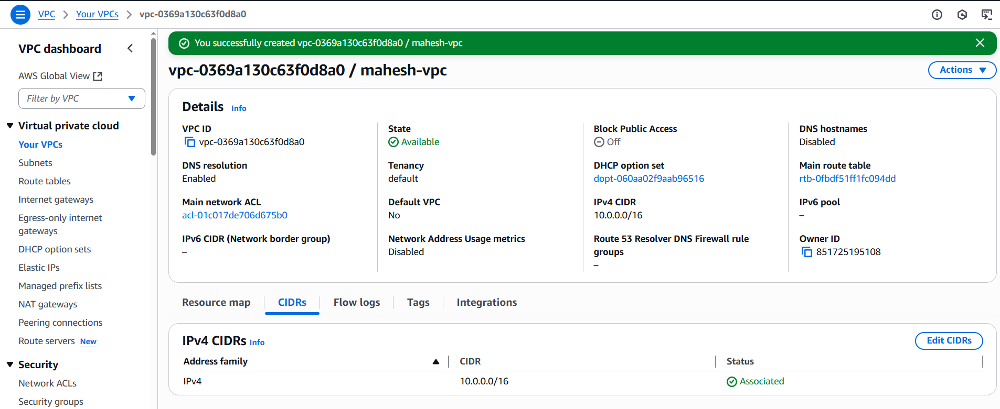

### Subnets
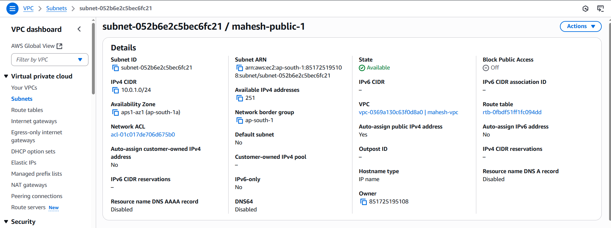  
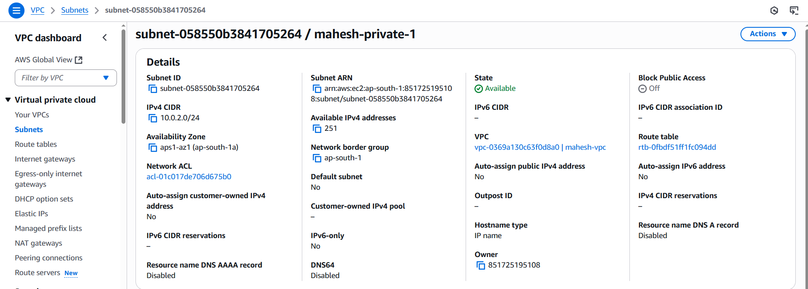

### Internet Gateway
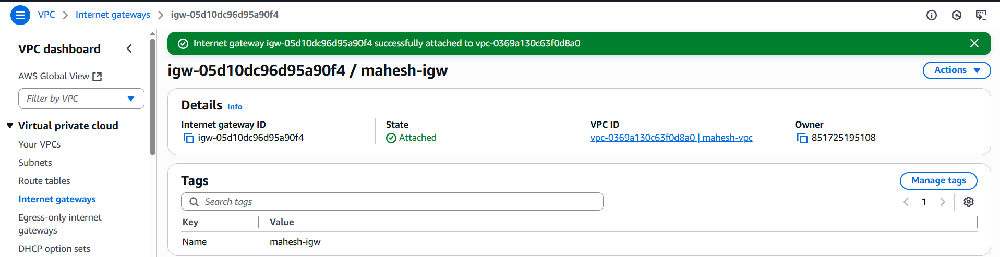

### Route Tables
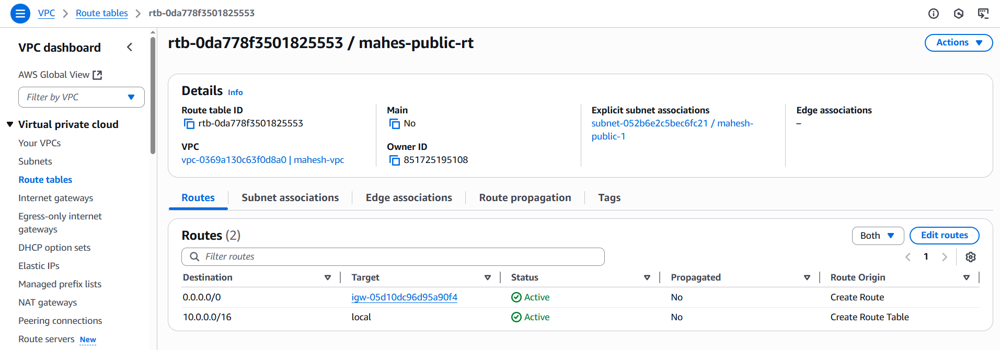  
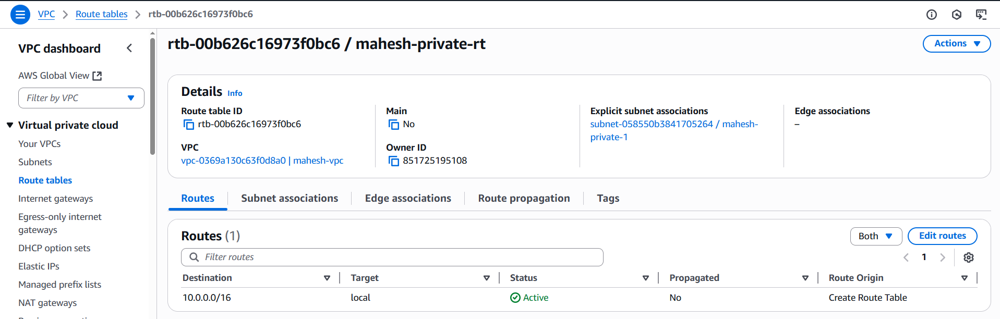

### Security Groups
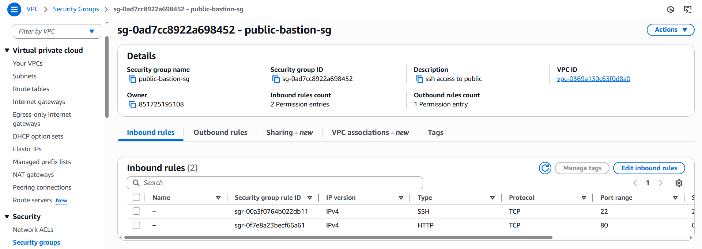  
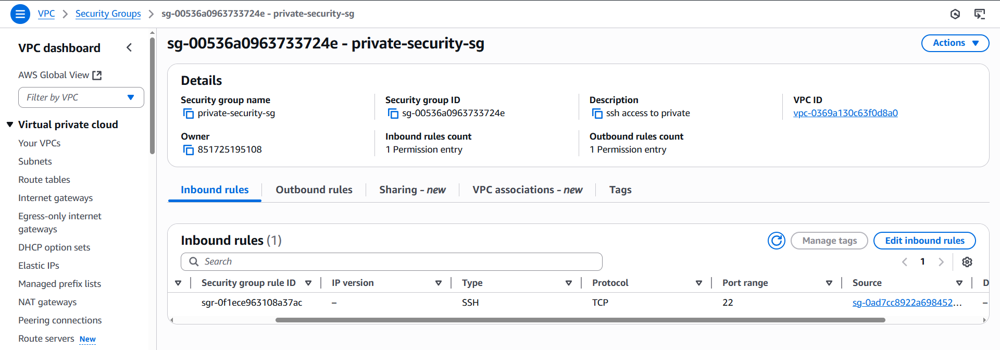

### EC2 Instances
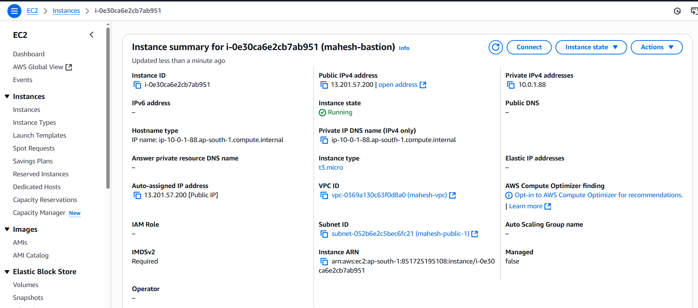  
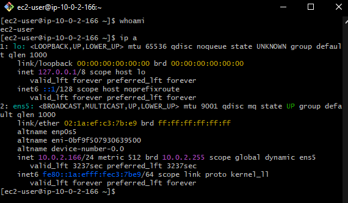

### SSH Connectivity
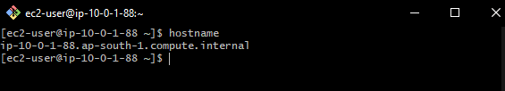  
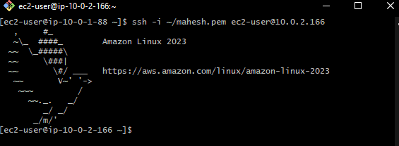
---

<h2 id="key-highlights">✨ Key Highlights</h2>

| Feature | Description |
|---|---|
| 🟢 **Free Tier Safe** | No NAT Gateway — uses Bastion for internal access |
| 🌍 **Region** | `ap-south-1 (Mumbai)` |
| 💻 **Instances** | 2× Amazon Linux 2023 (`t2.micro`) |
| 🔐 **Security** | Bastion → open only to your IP |
| ⚙️ **Networking** | Custom VPC with public/private subnets |
| 🧱 **Web Server** | NGINX running on both instances |
| 🧰 **Tools Used** | EC2, VPC, IGW, Route Tables, Security Groups, SSH |

---

<h2 id="components-overview">🧩 Components Overview</h2>

| Resource | CIDR / Notes |
|---|---|
| **VPC** | `10.0.0.0/16` |
| **Public Subnet** | `10.0.1.0/24` |
| **Private Subnet** | `10.0.2.0/24` |
| **Internet Gateway** | Attached to VPC |
| **Route Tables** | Separate for Public & Private |
| **Security Groups** | Bastion ↔ Private EC2 controlled |
| **SSH Key** | `my-key.pem` |

---

<h2 id="setup-guide-step-by-step">⚙️ Setup Guide (Step-by-Step)</h2>

> ⏱️ **Time Required:** 45–60 minutes  
> 💰 **Cost:** Free (within AWS Free Tier)  
> 💡 **Difficulty:** Beginner–Intermediate

---

<h3 id="step-1---create-the-vpc">Step 1 — Create the VPC</h3>

- Name: `project-vpc`  
- CIDR: `10.0.0.0/16`

---

<h3 id="step-2---create-subnets">Step 2 — Create Subnets</h3>

- **Public Subnet**: `10.0.1.0/24` — Auto-assign public IP: **Yes**  
- **Private Subnet**: `10.0.2.0/24` — Auto-assign public IP: **No**

---

<h3 id="step-3---internet-gateway">Step 3 — Internet Gateway</h3>

- Create IGW: `project-igw`  
- Attach to `project-vpc`  
💡 Purpose: Allows internet access only for public subnet resources.

---

<h3 id="step-4---route-tables">Step 4 — Route Tables</h3>

- **Public Route Table**: Add route `0.0.0.0/0 → project-igw` and associate with public subnet.  
- **Private Route Table**: Associate with private subnet — **no** internet route.

---

<h3 id="step-5---security-groups">Step 5 — Security Groups</h3>

**Bastion SG (`sg-bastion`)**

| Type | Port | Source |
|---|---:|---|
| SSH | 22 | Your public IP (`x.x.x.x/32`) |
| HTTP | 80 | `0.0.0.0/0` (optional) |

**Private SG (`sg-private`)**

| Type | Port | Source |
|---|---:|---|
| SSH | 22 | `sg-bastion` (reference) |

> ✅ Bastion can SSH into Private EC2.  
> ✅ Private EC2 not exposed to internet.

---

<h3 id="step-6---launch-ec2-bastion">Step 6 — Launch EC2 (Bastion)</h3>

- Public Subnet: `public-subnet-1`  
- AMI: Amazon Linux 2023  
- Instance Type: `t2.micro`  
- SG: `sg-bastion`  
- Key Pair: `my-key.pem`  

**Connect from your laptop:**
```bash
chmod 400 my-key.pem
ssh -i my-key.pem ec2-user@<BASTION_PUBLIC_IP>
```


<h3 id="step-7---launch-private-ec2">Step 7 — Launch Private EC2 (Private Subnet)</h3>

|Setting|Value|
|---|---|
|Name|`private-ec2`|
|AMI|Amazon Linux 2023|
|Instance Type|`t2.micro`|
|Subnet|`private-subnet-1`|
|Public IP|None|
|SG|`sg-private`|
|Key Pair|`my-key.pem`|

**Connect via Bastion (from Bastion shell):**

### On Bastion
```
ssh -i my-key.pem ec2-user@<PRIVATE_EC2_IP>
```


<h3 id="step-8---validate-connectivity">Step 8 — Validate SSH Connectivity</h3>

**From your Laptop → Bastion (Public EC2):**

**On Bastion (Public):**
```
chmod 400 mahesh.pem
ssh -i mahesh.pem ec2-user@<BASTION_PUBLIC_IP>
```

**On Private EC2:**

```
ssh -i mahesh.pem ec2-user@<PRIVATE_EC2_IP>
```
> ✅ Verify that you can SSH from your laptop to Bastion.  
> ✅ Verify that you can SSH from Bastion into Private EC2.  
> ✅ This confirms your **VPC, Subnets, Security Groups, and Bastion Host** are configured correctly.

<h3 id="step-9---validate-setup">Step 9 — Validate Setup</h3>

Use AWS CLI or Console to verify resources:

```
aws ec2 describe-instances
aws ec2 describe-subnets
aws ec2 describe-security-groups
aws ec2 describe-route-tables
```


<h3 id="step-10---cleanup-avoid-charges">Step 10 — Cleanup (Avoid Charges)</h3>

Terminate instances and delete networking resources (or delete via Console):
```
# Terminate instances
aws ec2 terminate-instances --instance-ids <bastion-id> <private-id>

# Delete networking components
aws ec2 delete-subnet ...
aws ec2 delete-route-table ...
aws ec2 detach-internet-gateway ...
aws ec2 delete-internet-gateway ...
aws ec2 delete-vpc --vpc-id <vpc-id>
```
Or simply delete everything via AWS Console.


<h2 id="screenshots-guide-filenames">📸 Screenshots Guide (Filenames)</h2>

|Step|Screenshot|Description|
|---|---|---|
|1|`vpc-created.png`|Custom VPC creation confirmed|
|2|`subnets.png` & `subnets-private.png`|Public & Private subnets with CIDRs|
|3|`igw-attached.png`|Internet Gateway attached|
|4|`route-table-public.png` & `route-table-private.png`|Public/Private route tables|
|5|`security-groups.png` & `private-security-group.png`|Security Groups rules|
|6|`ec2-bastion.png`|Bastion EC2 running|
|7|`private-ssh.png`|Private EC2 running|
|8|`ssh-bastion-terminal.png` & `private-terminal.png`|SSH: Laptop → Bastion → Private EC2|

<h2 id="learning-outcomes">📚 Learning Outcomes</h2>

|Feature|Description|
|---|---|
|🟢 **Free Tier Safe**|No NAT Gateway — uses Bastion for internal access|
|🌍 **Region**|`ap-south-1 (Mumbai)`|
|💻 **Instances**|2× Amazon Linux 2023 (`t2.micro`)|
|🔐 **Security**|Bastion → open only to your IP|
|⚙️ **Networking**|Custom VPC with public/private subnets|
|🧱 **Access**|Bastion → Private EC2 SSH only|
|🧰 **Tools Used**|EC2, VPC, IGW, Route Tables, Security Groups, SSH|

---

<h2 id="tech-stack">🧰 Tech Stack</h2>

- Amazon VPC
    
- EC2 (Amazon Linux 2023)
    
- Internet Gateway
    
- Route Tables
    
- Security Groups
    
- SSH
  
<h2 id="project-structure">📂 Project Structure</h2>

```
aws-vpc-bastion-architecture/
├── README.md
├── architecture.png
└── screenshots/
    ├── vpc-created.png
    ├── subnets.png
    ├── igw-attached.png
    ├── route-table-public.png
    ├── route-table-private.png
    ├── security-groups.png
    ├── ec2-bastion.png
    ├── ec2-private.png
    ├── ssh-connection.png
    ├── nginx-public.png
    └── nginx-private.png
```

<h2 id="ideal-for">💼 Ideal For</h2>

✅ DevOps Engineers
✅ Cloud Enthusiasts
✅ AWS Certification Prep
✅ Portfolio & Resume Boost
✅ Free-Tier AWS Labs


<h2 id="license">📜 License</h2>

MIT License © 2025 [Mahesh Shukla](https://github.com/MaheshShukla1)
